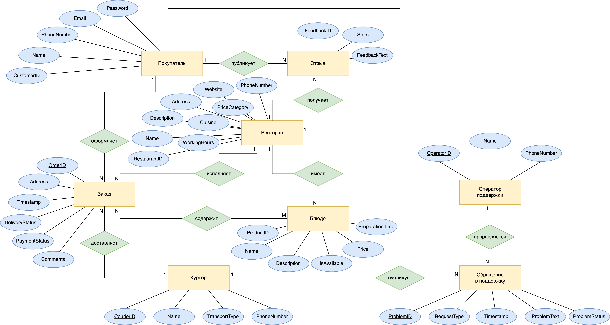

# ДЗ-1

## Задание

Вам поручили разработать базу данных для управления заказами в онлайн-сервисе доставки еды.

Система должна обрабатывать создание, изменение и управление статусом заказов, включая выбор блюд, оплату и доставку.

- Определите роли пользователей и действия для каждой роли
- Определите объекты, в которых будут храниться данные
- Определите связи между объектами для хранения данных
- Нарисуйте схему объектной модели (используя любые обозначения, которые вам удобны). Объекты и связи на предыдущих шагах можно сразу обозначать в виде итоговой схемы

## Роли

- Покупатель
  - формирует корзину
  - оформляет заказ
  - оплачивает заказ
  - отменяет заказ
  - обращается к поддержке
  - оставляет отзыв о ресторане
- Ресторан
  - принимает заказ
  - корректирует заказ (например, убирает из заказа блюда, которые в данный момент невозможно приготовить)
  - управляет наличием блюд в меню
  - отменяет заказ
  - обращается к поддержке
  - передает заказ курьеру
- Курьер
  - принимает заказ у ресторана
  - обращается в поддержку
  - доставляет заказ покупателю 
- Оператор поддержки
  - устраняет технические проблемы покупателей / ресторанов / курьеров
  - разрешает конфликтные ситуации (например, связанные с задержкой доставки или отменой заказа)
  - возвращает деньги за заказ

## Entity–Relationship Diagram

