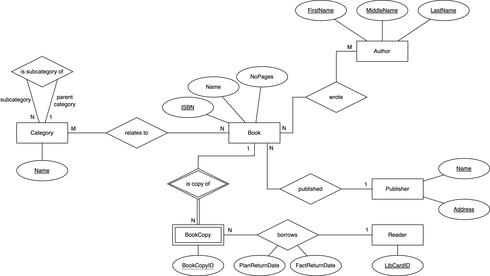
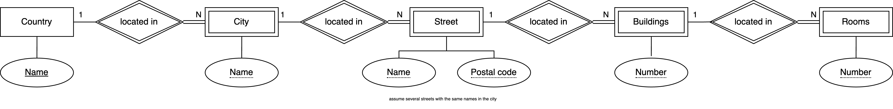
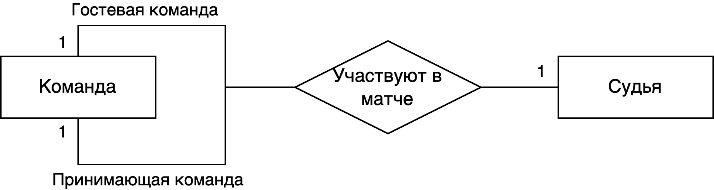
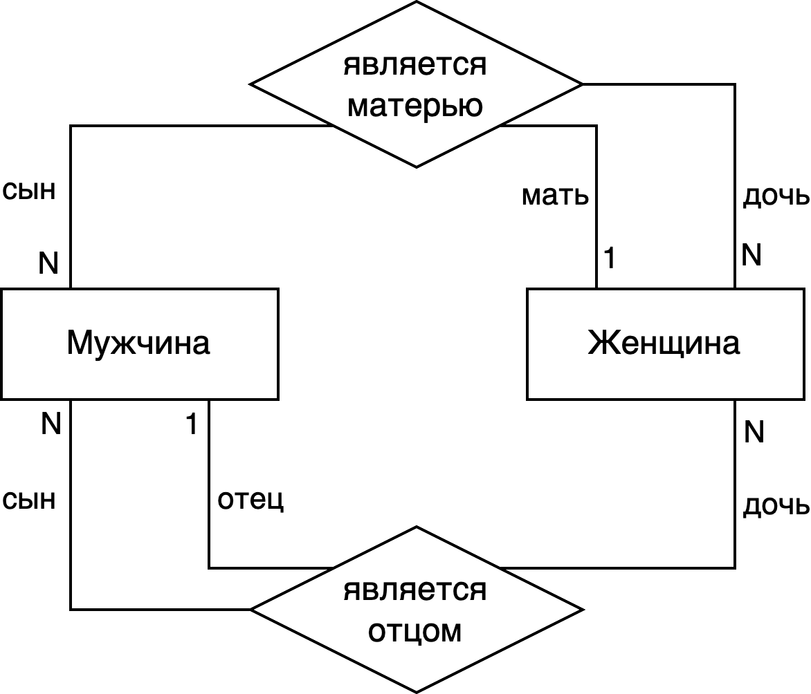

# ДЗ-2

- [ДЗ-2](#дз-2)
  - [Задание 1](#задание-1)
  - [Задание 2](#задание-2)
    - [Пункт 1](#пункт-1)
    - [Пункт 2](#пункт-2)
    - [Пункт 3](#пункт-3)
  - [Задание 3](#задание-3)
  - [Вывод](#вывод)

## Задание 1

Спроектируйте E/R-диаграмму для оффлайн-библиотеки:

В библиотеке хранятся экземпляры книг. Для каждой книги известны: уникальный международный идентификатор издания ISBN, название, список авторов, название издательства, количество страниц. У всех экземпляров одной и той же книги все эти данные совпадают, а для различения экземпляров при поступлении в библиотеку на каждом из них проставляется номер. Для издательств известны их названия и адреса. Для категоризации книг используется иерархический классификатор с одним корневым узлом (дерево). Каждая книга может относиться к одной или нескольким категориям. Названия категорий уникальны.

Читатели получают читательские билеты, номера которых не повторяются.

Читатели могут брать книги домой, при этом фиксируется как плановая, так и фактическая дата возврата каждой книги.

Тут была предпринята попытка максимально следовать заданию, не создавая ничего дополнительно. Практически во всем получилось, кроме нескольких атрибутов (например, для автора)

## Задание 2

Спроектируйте E/R-диаграмму для следующих кейсов:

### Пункт 1

Квартиры (например, кв. 112) расположены в домах (например, дом 4), дома относятся к улицам (например, ул. Летняя), улицы – к городам (например, Солнечный город ), города – к странам (например, страна Коротышек).

 Тут очень хороший повод использовать **слабые сущности**: всем известно, что существует несколько городов Москва, также я обнаружил, что в нескольких городах существуют улицы с одинаковыми названиями (именно поэтому есть необходимость хранить почтовый индекс вместе с названием в качестве ключа), ну а про дома все еще понятнее. 

### Пункт 2

В каждом матче участвуют две команды, а судит каждый матч один судья.

К сожалению, в классической нотации невозможно (насколько мне известно) обозначить **Mandatory One**, но здесь это подразумевается. Также тут принимается, что матч судит один судья.

### Пункт 3

У каждого человека есть отец и мать.

В рекурсивных связях особое значение имеют роли, вот тут они и обозначены.

## Задание 3

Спроектируйте E/R-диаграмму, описывающую саму модель E/R:

Сущности E/R: сущность, связь, атрибут сущности, атрибут связи, слабая сущность, слабая связь.

Здесь используются подклассы и суперклассы.

Особого внимания заслуживает тернарная связь между **Weak Entity**, **Weak Relationship**, **Entity**. Основная проблема, с которой я столкнулся здесь – это кардинальность (тяжело указать кардинальность для тернарной связи, да еще и в min-max нотации). Пришлось обращаться к посторонним ресурсам, вот что получилось найти

По чтению нотаций
1. [Stack overflow](https://stackoverflow.com/questions/34506945/erm-cardinality-in-ternary-relationships): чтобы определить кардинальность в тернарной связи A, B, C в нотации min-max, необходимо задаться вопросом: если у меня есть экземпляр A, сколько экземпляров B и C вместе взятых могут ассоциироваться с A через определенную связь. Ответ на этот вопрос – то, что ставится над стрелкой, ведущей из A в Relationship.
2. [Stack overflow](https://stackoverflow.com/questions/18365870/er-diagram-ternary-relationship-how-to-read-properly): то же самое, но в классической нотации:
    > "One of A and one of B can {have/associate with/belong to} X? of C". We need to use our knowledge of our business model to answer if X? should be 1 or N. This is the cardinality to assign to the ternary relationship on the edge that connects the ternary relationship with the entity C.
3. [Stack overflow](https://stackoverflow.com/questions/50687310/how-to-create-a-ternary-relationship-that-has-a-weak-entity): создание тернарной связи между Weak Entities не имеет практического применения, поэтому в моем схеме отношения только бинарные.

Руководствуясь этими материалами, что-то вот такое и получилось.

## Вывод

Спасибо за внимание 👍