# ДЗ-3

- [ДЗ-3](#дз-3)
  - [Задание 1](#задание-1)
  - [Задание 2](#задание-2)
    - [ER Diagram Библиотека](#er-diagram-библиотека)
    - [Несколько маленьких диаграмму](#несколько-маленьких-диаграмму)
    - [ER Diagram "ER"](#er-diagram-er)
  - [Задание 3](#задание-3)
    - [Hospital](#hospital)
    - [Stations](#stations)
  - [Вывод](#вывод)

## Задание 1

*Почему у каждого отношения в реляционной БД должен быть хотя бы один ключ?*

Во-первых, заметим, что для у любого непустого отношения (непустое значит имеющее хоть один атрибут) есть ключ, так как по определению ключом является наименьший по вложению суперключ, а им может являться множество всех атрибутов отношения.

Назначение ключа – идентификация кортежа и его поиск. Также ключи помогают поддерживать целостность данных, они ограничивают создание элементов с одинаковыми (первичными) ключами, связывают отношения между собой (внешние).

##  Задание 2

### ER Diagram Библиотека

Reference:

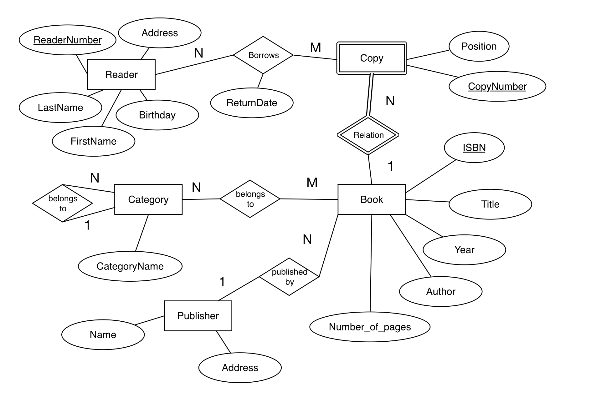

Relational Database:

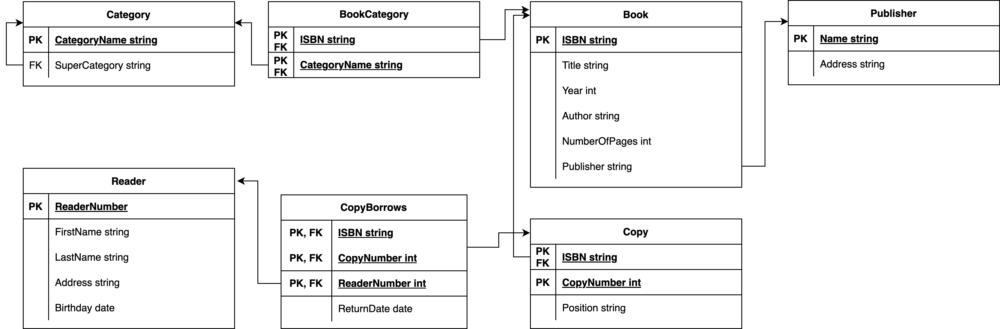

### Несколько маленьких диаграмму

Reference:

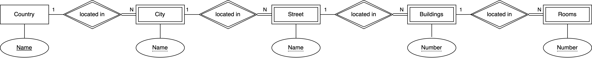

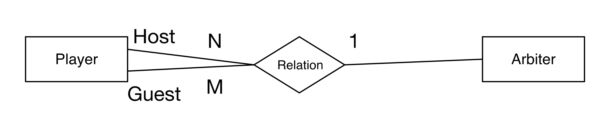 

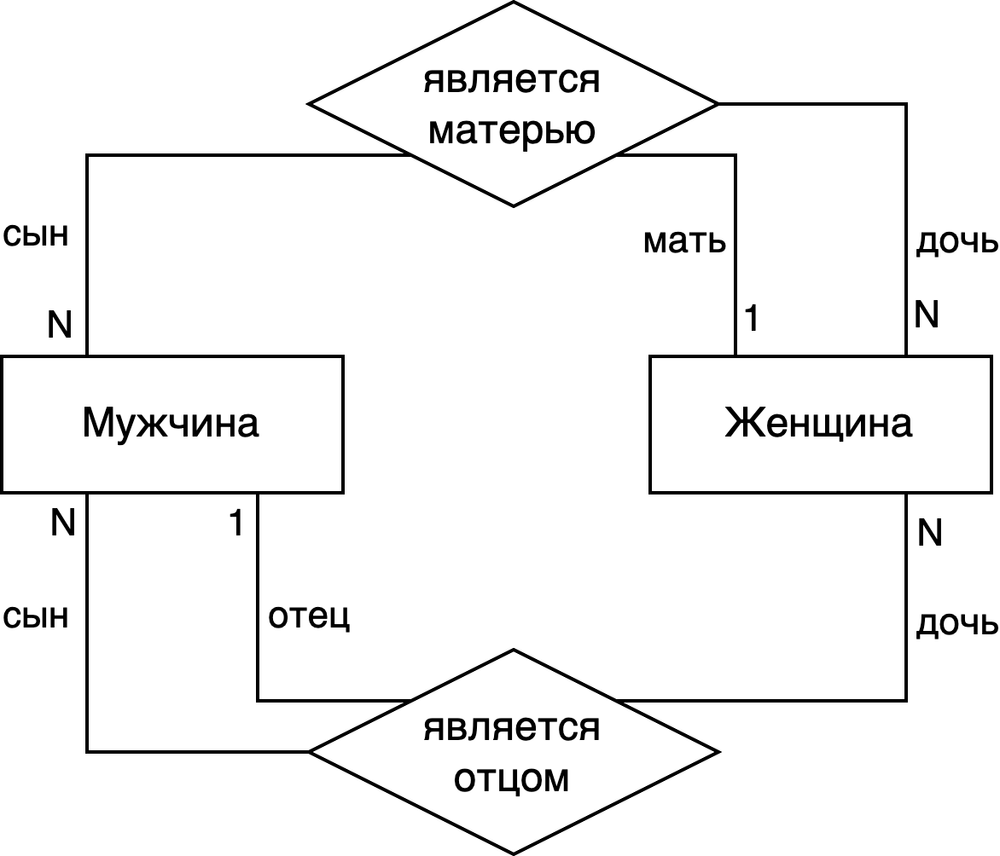

Relational Database:

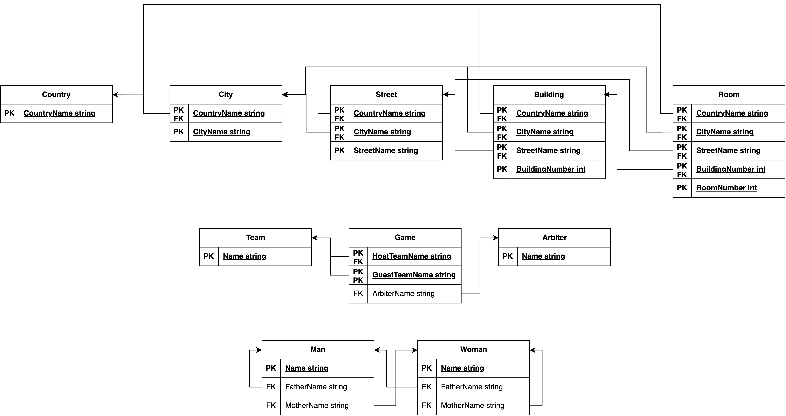

### ER Diagram "ER"

Reference:

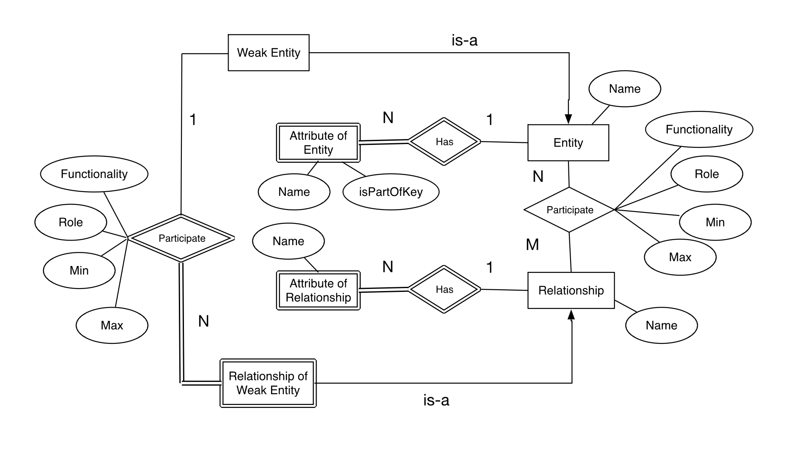

Relational Database:

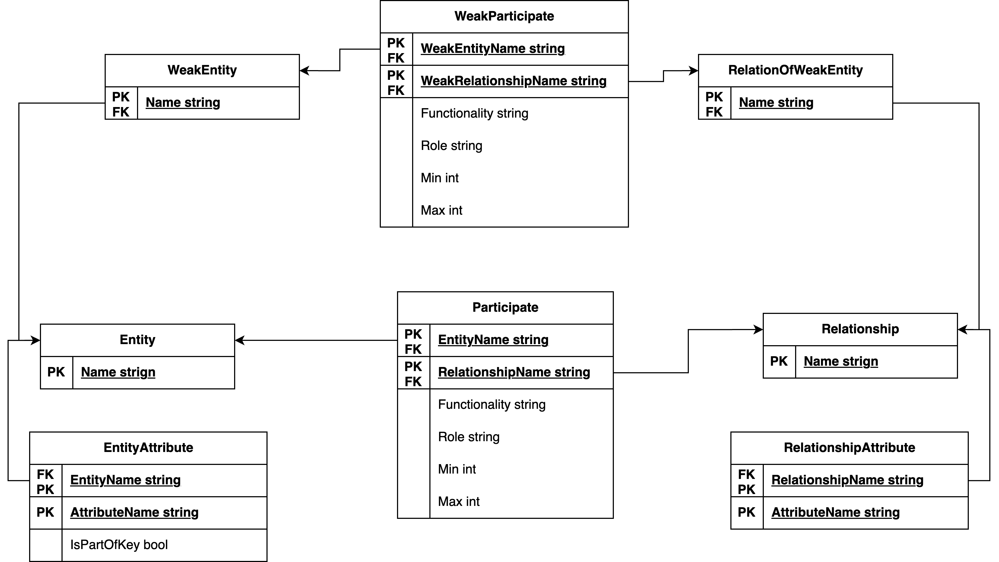

## Задание 3

### Hospital

Reference:

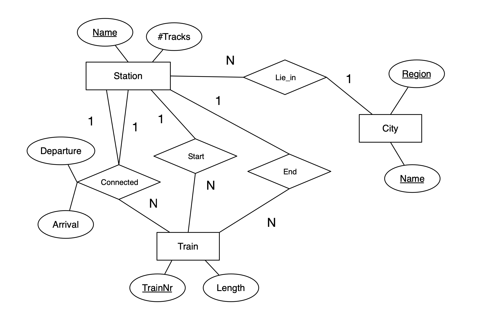

Relational Database:

### Stations

Reference:

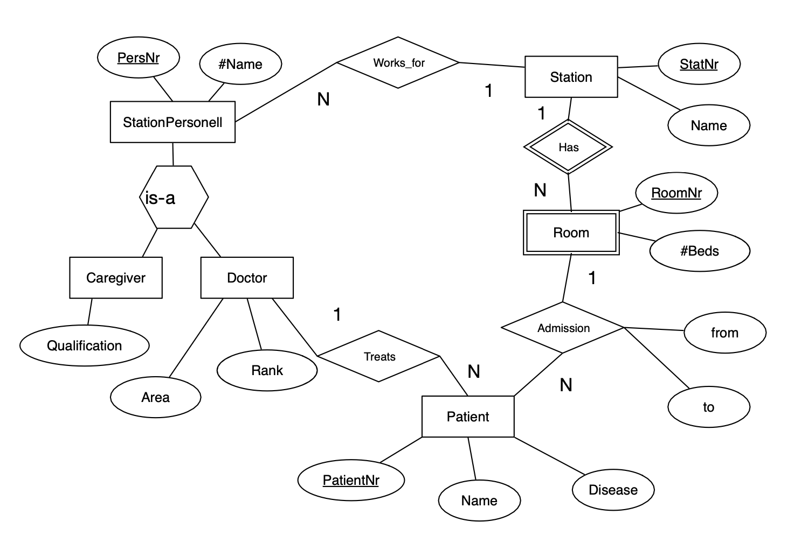

Relational Database:

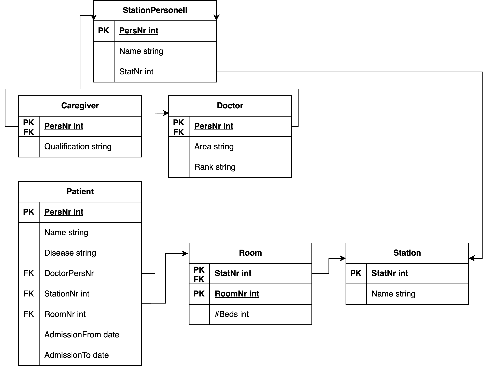

## Вывод

Спасибо за внимание 👍