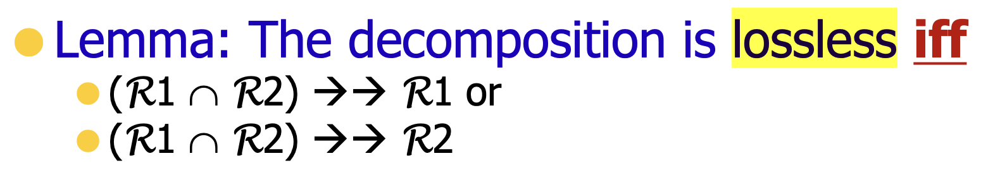

# ДЗ-7

<!-- [1pt] 1. Замыкание атрибутов (attribute closure)

Для отношения (A,B,C,D,E,G) заданы функциональные зависимости:

AB → C
C → A
BC → D
ACD → B
D → EG
BE → C
CG → BD
CE → AG

Постройте замыкание атрибутов (BD)+

[1 pt] 2. Функциональные зависимости

Дано отношение Заказы: Order (ProductNo, ProductName, CustomerNo, CustomerName, OrderDate, UnitPrice, Quantity, SubTotal, Tax, Total)

Tax rate depends on the Product (e.g., 20% for books or 30% for luxury items).

Only one order per product and customer is allowed per day (several orders are combined).

A) Determine the non-trivial functional dependencies in the relation

B) What are the key candidates?

[1 pt] Exercise 3. 3NF

Consider relation R(A,B,C,D) with the following functional dependencies:
F = {A→D, AB→ C, AC→ B}

A) What are all candidate keys?

B) Convert R into 3NF using synthesis algorithm from textbook.

Exercise 4. Complex example

Consider the relation Items(Vendor, Brand, Kind, Weight, Store) that represent a store stocks.

Convert sentences A)-C) from English text into a functional or a multi-valued dependencies.

[0.5pt] A) A Vendor holds the trademark for a brand (limited to item of a particular kind), so two different Vendors can't use the same brand name for items of the same kind.

[0.5pt] B) For each item kind, each store sells only single brand name made by each Vendor.

[0.5pt] C) If a particular item (vendor, brand name, and kind) is available in a particular weight at a store, then that weight is available at all stores carrying that item.

[0.5pt] D) Now assume that all the functional and/or multi-valued dependencies you specified does hold in Items, and no other dependencies hold in Items. What are the keys for Items?

[1pt] E) What normal forms does Items satisfy?

[1pt]F) Is this decomposition is lossless or not? Why?

Items1(Vendor, Brand, Kind, Store) 

Items2(Vendor, Brand, Kind, Weight)

[1pt] G) What normal forms does the decomposition in F) satisfy?

[1 pt] H) Decompose Items into a set of relations that are in BCNF such that the decomposition is lossless. Is this decomposition dependency-preserving?

[1pt] I) Find a lossless dependency-preserving decomposition of Items into 3NF using 3NF synthesis algorithm. -->

## 1. Attribute closure

Input:
- $F = (A,B,C,D,E,G)$
- $\alpha = BD$

Применяем алгоритм

BDEGCA

$$ 
\begin{gather*}
    D \rightarrow EG\\
    BE \rightarrow C\\
    CG \rightarrow BD\\
    CE \rightarrow AG\\
    AB \rightarrow C\\
    C \rightarrow A\\
    BC \rightarrow D\\
    ACD \rightarrow B\\
\end{gather*}
$$

Получилось пройти по всем функциональным зависимостям и собрать все атрибуты

$$(BD)+ = ABCDEG$$

## 2. Функциональные зависимости

Дано отношение Заказы: Order (ProductNo, ProductName, CustomerNo, CustomerName, OrderDate, UnitPrice, Quantity, SubTotal, Tax, Total)

ProductNo -> Tax

### A) Determine the non-trivial functional dependencies in the relation

ProductNo -> Tax

ProductNo -> ProductName

ProductNo -> UnitPrice

CustomerNo -> CustomerName

{ProductNo, CustomerNo, OrderDate} -> {ProductNo, ProductName, CustomerNo, CustomerName, OrderDate, UnitPrice, Quantity, SubTotal, Tax, Total} (понятно, что можно перечислять не все атрибуты, так как некоторые из них получаются по транзитивности, однако такая запись пригождается в пункте B) )

Очевидно, что можно еще перечислять различные комбинации (объединения) функциональных зависимостей (с помощью аксиом), но это уже приводимые к базовым зависимости, поэтому перечислять здесь их не считаю необходимым.

### B) What are the key candidates?

В нашем случае есть всего один суперключ ($\alpha \rightarrow \mathcal{R}$) это {ProductNo, CustomerNo, OrderDate}. Он единственный, следовательно минимальный, а следовательно является потенциальным ключом. Так как потенциальный ключ единственный, то он также является первичным ключом.

## 3. 3NF

Consider relation R(A,B,C,D) with the following functional dependencies:
F = {A→D, AB→ C, AC→ B}

### A) What are all candidate keys?

Атрибут $A$ точно должен входить в потенциальный ключ, так как он не участвует в функциональных зависимостях "справа". Посмотрим, какие атрибуты мы можем получить, имея $A$: $AD$. Этого нам не хватает, но зато мы точно знаем, что $D$ не будет входить в потенциальный ключ (иначе функциональная зависимость не будет минимальной).

Попробуем добавить к $\alpha$ атрибут $B$, итак, $AB \rightarrow CD \Longrightarrow AB \rightarrow ABCD$. Опробуем также $AC$: $AC \rightarrow BD \Longrightarrow AC \rightarrow ABCD$.

Итак, мы нашли два потенциальных ключа:

$$
\begin{gather*}
    AB\\
    AC
\end{gather*}
$$

### B) Convert R into 3NF using synthesis algorithm from textbook.

Посчитаем минимальный базис по алгоритму, получаем, что в него входят все функциональные зависимости.

Создаем отношения для каждой функциональной зависимости в базисе:

$$\mathcal{R}_A \coloneqq A \cup D$$

$$\mathcal{R}_{AB} \coloneqq A \cup B \cup C$$

$$\mathcal{R}_{AC} \coloneqq A \cup C \cup B$$

Одно из последних двух отношений нужно удалить, получим искомую 3NF:

$$\mathcal{R}_A \coloneqq A \cup D$$

$$\mathcal{R}_{AB} \coloneqq A \cup B \cup C$$

## 4. Complex example

Consider the relation Items(Vendor, Brand, Kind, Weight, Store) that represent a store stocks.

Сразу замечу, что для всех функциональных отношений $\alpha \rightarrow \beta \Longrightarrow \alpha \rightarrow\rightarrow \beta$, поэтому далее при функциональной зависимости это не указывается.

### A) A Vendor holds the trademark for a brand...

A Vendor holds the trademark for a brand (limited to item of a particular kind), so two different Vendors can't use the same brand name for items of the same kind.

{Brand, Kind} -> Vendor

### B) For each item kind, each store sells only single brand name made by each Vendor

{Vendor, Store, Kind} -> Brand

### C) If a particular item is available in a particular weight at a store, then that weight is available at all stores carrying that item.

If a particular item (vendor, brand name, and kind) is available in a particular weight at a store, then that weight is available at all stores carrying that item.

{Vendor, Brand, Kind} ->-> Weight

{Vendor, Brand, Kind} ->-> Store (по свойствам)

### D) Keys for Items

Now assume that all the functional and/or multi-valued dependencies you specified does hold in Items, and no other dependencies hold in Items. What are the keys for Items?

Многозначные зависимости мало могут сказать нам что-то о ключах, поэтому будем ориентироваться на функциональные (всего их было выявлено две).

Имея только две этих функциональных зависимости, очевидно, что ключем будет являться {Vendor, Store, Kind, Weight} или {Brand, Store, Kind, Weight}

### E) What normal forms does Items satisfy?

Будем идти по подряд по каждой нормальной форме по возрастанию. Если на какому-то шаге условия не будут выполняться, то последующие шаги можно уже не рассматривать.

**1НФ:** все значения скалярные, повторений нет, значит, действительно, Items удовлетворяет условия 1НФ.

**2НФ:** нет, так как неключевой атрибут Vendor не полностью зависит от потенциального ключа {Brand, Store, Kind, Weight}

### F) Is this decomposition is lossless or not? Why?

**Items1(Vendor, Brand, Kind, Store)**

**Items2(Vendor, Brand, Kind, Weight)**

Проверим по лемме: $\text{Items1} \cap \text{Items2} = {\text{Vendor}, \text{Brand}, \text{Kind}}$

{Vendor, Brand, Kind} ->-> Weight

{Vendor, Brand, Kind} ->-> Store (по свойствам)

Значит, декомпозиция *lossless*.

### G) What normal forms does the decomposition in F) satisfy?

Данная декомпозиция на Item1(Vendor, Brand, Kind, Store) и Item2(Vendor, Brand, Kind, Weight) похоже на стандартный метод борьбы с многозначной зависимостью. Приведу стандартный пример с лекции:

Стоит обратить внимание на то, что в данном случае (Vendor, Brand, Kind) является суперключом, однако не является ключом, так как по доказанному выше {Brand, Kind} -> Vendor. Это замечание делает данный пункт довольно противоречивым, но посмею предположить, что здесь мы должны рассматривать ключ как $\mathcal{R}_1 \cap \mathcal{R}_2 = (\text{Vendor}, \text{Brand}, \text{Kind})$. В таком случае декомпозиция принимает 4NF.

### H) Decompose Items into a set of relations that are in BCNF such that the decomposition is lossless. Is this decomposition dependency-preserving?

<!-- {Vendor, Store, Kind, Weight} или {Brand, Store, Kind, Weight} -->
<!-- {Brand, Kind} -> Vendor
{Vendor, Store, Kind} -> Brand -->

Имеем отношение **Items(Vendor, <ins>Brand</ins>, <ins>Kind</ins>, Weight, Store)**.

Знаем (Brand, Kind) -> Vendor, тогда пусть **Items1(<ins>Brand</ins>, <ins>Kind</ins>, Vendor)**

Остаток: пусть **Items2(<ins>Brand</ins>, <ins>Kind</ins>, Weight, Store)**.

В Items2 мы допускаем различные аномалии, связанные с тем, что в этом отношении находится многозначная зависимость, однако же это никак не влияет на результат — **BCNF**!

Что касается *dependency-preserving*, приведенная декомпозиция таковой не является. Например, рушится зависимость {Vendor, Store, Kind} -> Brand.

### I) Find a lossless dependency-preserving decomposition of Items into 3NF using 3NF synthesis algorithm.

В 3NF нас не интересуют Многозначные зависимости, поэтому выпишу только функциональные:

{Brand, Kind} -> Vendor

{Vendor, Store, Kind} -> Brand

Это и есть наш минимальный базис. Теперь создаем отношения:

$$\mathcal{R_1} = \{\text{Brand}, \text{Kind}\} \cup \{\text{Vendor}\}$$

$$\mathcal{R_2} = \{\text{Vendor}, \text{Store}, \text{Kind}\} \cup \{\text{Brand}\}$$

Добавляем оставшиеся

$$\mathcal{R_3} = \{\text{Vendor}, \text{Brand}, \text{Kind}\} \cup \{\text{Weight}\}$$

Каждый из этих ключей уже входит в отношения, сократить тут тоже ничего больше не можем, значит это и есть 3NF.

Также заметим, что все изначальные зависимости сохранены, то есть находятся в одном отношении-таблице.

